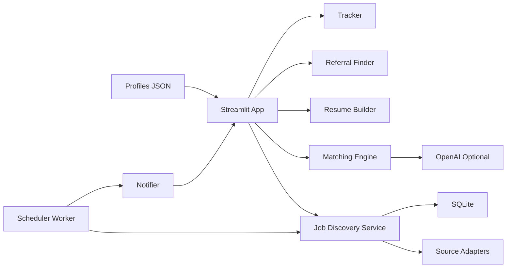

# AI Job Agent

This repository started as a lightweight job-hunting prototype with:

- a `Naukri` scraper in JavaScript
- a mock Express profile route
- placeholder React profile and job feed components

It has now been upgraded into a runnable MVP for an AI-powered job automation platform while preserving those original pieces under `services/legacy`, `backend/legacy_routes`, and `frontend/legacy`.

## What It Does

- discovers recent jobs from LinkedIn, Naukri, Indeed, and company career pages
- filters jobs posted within the last hour
- accepts uploaded master profiles in DOCX
- uses uploaded profile text for matching, ranking, and resume generation
- scores jobs from `0-100`
- generates PDF and DOCX resumes
- suggests referral contacts and editable outreach messages
- tracks saved/applied jobs
- sends email notifications for high-fit roles
- provides a Streamlit dashboard gated by profile upload
- stores uploaded profile text for autonomous background runs

## Updated Structure

```text
backend/
  database.py
  profile_text_store.py
  legacy_routes/profile.js
frontend/
  dashboard.py
  legacy/components/
models/
  entities.py
services/
  company_jobs.py
  job_discovery.py
  job_sources.py
  matching_engine.py
  notifier.py
  openai_client.py
  role_recommender.py
  referral_finder.py
  resume_builder.py
  tracker.py
  worker.py
  legacy/naukriScraper.js
utils/
  config.py
  text.py
  time_utils.py
data/
  profiles/
  exports/
app.py
run_worker.py
requirements.txt
```

## Architecture



## Quick Start

1. Create a virtual environment and install dependencies:

```bash
pip install -r requirements.txt
```

2. Copy `.env.example` to `.env` and set any keys you want to enable.

3. Start the dashboard:

```bash
streamlit run app.py --server.port 10000 --server.address 0.0.0.0
```

4. Optional: run the 30-minute scheduler worker:

```bash
python run_worker.py
```

5. Upload a `.docx` master profile from the sidebar.
6. The app reads the uploaded DOCX into `st.session_state["profile_text"]` and uses that text everywhere profile context is needed.

## Deployment

- Install from `requirements.txt`
- Provide `.env` secrets
- Use SQLite for the database file at `data/job_agent.db`
- Start command:

```bash
streamlit run app.py --server.port 10000 --server.address 0.0.0.0
```

- Docker is included with the same Streamlit entrypoint
- `docker-compose up --build` starts both the Streamlit app and the background worker

## Continuous Background Run

- Local worker loop: `python run_worker.py`
- Windows: run the worker with `pythonw run_worker.py` or register it with Task Scheduler
- Linux: run the worker as a `systemd` service that executes `python run_worker.py`
- Docker: `docker-compose up --build` keeps the app and worker running independently of the terminal

## Example Job Scoring Output

```json
{
  "score": 93,
  "missing_skills": [],
  "strengths": ["ESG", "Climate", "Energy", "Python", "Power BI"],
  "fit": "Excellent"
}
```

## Example Resume Output

Generated files land in `data/exports/`:

- `emil_roby_job_001.pdf`
- `emil_roby_job_001.docx`

The generated resume keeps the master profile structure, rewrites the summary for the target role, and reorders experience by relevance.

## Notes

- OpenAI parsing and embedding similarity are optional and activate only when `OPENAI_API_KEY` is configured.
- Email alerts activate only when SMTP credentials are configured.
- Redis is optional for later Celery expansion; the current runnable MVP uses the built-in scheduler loop.
- Uploaded DOCX profile text is persisted to `data/profiles/active_profile.txt` for the background worker.
