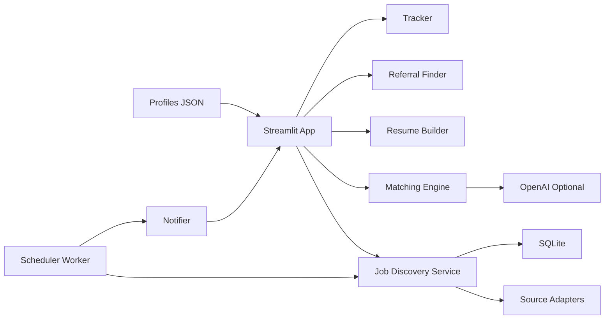

# AI Job Agent

This repository started as a lightweight job-hunting prototype with:

- a `Naukri` scraper in JavaScript
- a mock Express profile route
- placeholder React profile and job feed components

It has now been upgraded into a runnable MVP for an AI-powered job automation platform while preserving those original pieces under `services/legacy`, `backend/legacy_routes`, and `frontend/legacy`.

## What It Does

- discovers recent jobs from LinkedIn, Naukri, Indeed, and fallback sources
- filters jobs posted within the last hour
- supports multiple user profiles from `data/profiles/*.json`
- parses job descriptions with optional OpenAI enrichment and local fallback parsing
- scores jobs from `0-100`
- generates PDF and DOCX resumes
- suggests referral contacts and editable outreach messages
- tracks saved/applied jobs
- sends email notifications for high-fit roles
- provides a Streamlit dashboard with lightweight login

## Updated Structure

```text
backend/
  auth.py
  database.py
  legacy_routes/profile.js
  profile_manager.py
frontend/
  dashboard.py
  legacy/components/
models/
  entities.py
services/
  job_discovery.py
  job_sources.py
  matching_engine.py
  notifier.py
  openai_client.py
  referral_finder.py
  resume_builder.py
  tracker.py
  worker.py
  legacy/naukriScraper.js
utils/
  config.py
  text.py
  time_utils.py
data/
  profiles/
  samples/
  exports/
app.py
run_worker.py
requirements.txt
```

## Architecture



## Quick Start

1. Create a virtual environment and install dependencies:

```bash
pip install -r requirements.txt
```

2. Copy `.env.example` to `.env` and set any keys you want to enable.

3. Start the dashboard:

```bash
streamlit run app.py --server.port 10000 --server.address 0.0.0.0
```

4. Optional: run the 30-minute scheduler worker:

```bash
python run_worker.py
```

5. Login with:

```text
username: demo
password: demo123
```

## Deployment

- Install from `requirements.txt`
- Provide `.env` secrets
- Use SQLite for the database file at `data/job_agent.db`
- Start command:

```bash
streamlit run app.py --server.port 10000 --server.address 0.0.0.0
```

- Docker is included with the same Streamlit entrypoint

## Example Job Scoring Output

```json
{
  "score": 93,
  "missing_skills": [],
  "strengths": ["ESG", "Climate", "Energy", "Python", "Power BI"],
  "fit": "Excellent"
}
```

## Example Resume Output

Generated files land in `data/exports/`:

- `emil_roby_job_001.pdf`
- `emil_roby_job_001.docx`

The generated resume keeps the master profile structure, rewrites the summary for the target role, and reorders experience by relevance.

## Notes

- OpenAI parsing and embedding similarity are optional and activate only when `OPENAI_API_KEY` is configured.
- Email alerts activate only when SMTP credentials are configured.
- Redis is optional for later Celery expansion; the current runnable MVP uses the built-in scheduler loop fallback.
